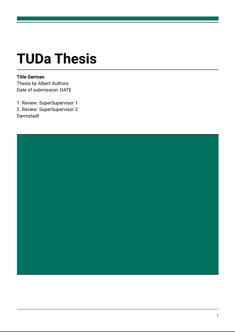

# Typst Template for the Corporate Design of TU Darmstadt [WIP]
This **unofficial** template can be used to write in [Typst](https://github.com/typst/typst) with the corporate design of [TU Darmstadt](https://www.tu-darmstadt.de/).

#### Disclaimer
Please ask your supervisor if you are allowed to use typst and this template for your thesis or other documents.
Note that this template is not checked by TU Darmstadt for correctness.
Thus, this template does not guarantee completeness or correctness.


## Implemented Templates
The templates imitate the style of the corresponding latex templates in [tuda_latex_templates](https://github.com/tudace/tuda_latex_templates).
Note that there can be visual differences between the original latex template and the typst template (you may open an issue when you find one).

For missing features, ideas or other problems you can open an issue. Contributions are also welcome.

| Template  | Preview | Example | Scope |
----|----|--|--|
|[tudapub](templates/tudapub/tudapub.typ) |  |  [example_tudapub.pdf](example_tudapub.pdf) <br/> [example_tudapub.typ](example_tudapub.typ)   |  Master and Bachelor thesis |


## Usage
Create a folder for your writing project and download this template into the `templates` folder:
```bash
mkdir my_thesis && cd my_thesis
mkdir templates && cd templates
git clone https://github.com/JeyRunner/tuda-typst-templates templates/
```
Download the tud logo from [download.hrz.tu-darmstadt.de/protected/ULB/tuda_logo.pdf](https://download.hrz.tu-darmstadt.de/protected/ULB/tuda_logo.pdf) and put it into the `templates/tuda-typst-templates/templates/tudapub/logos` folder.
Now execute the following script in the `logos` folder to convert it into an svg:
```bash
cd templates/tuda-typst-templates/templates/tudapub/logos
./convert_logo.sh
```

Also download the required fonts `Roboto` and `XCharter`:
```bash
cd templates/tuda-typst-templates/templates/tudapub/fonts
./download_fonts.sh
```
Now you can install all fonts in the folders in `templates/tuda-typst-templates/templates/tudapub/fonts` on your system.


Create a simple `main.typ` in the root folder (`my_thesis`) of your new project:
```js
#import " templates/tuda-typst-templates/templates/tudapub/tudapub.typ": tudapub

#show: tudapub.with(
  title: [
    My Thesis
  ],
  author: "My Name",
  accentcolor: "3d"
)

= My First Chapter
Some Text
```
And compile it:
```bash
typst --watch main.typ --font-path templates/tuda-typst-templates/templates/tudapub/fonts
```
This will watch your file and recompile it to a pdf when the file is saved. For writing you can use [Vscode](https://code.visualstudio.com/) with these extension: [Typst LSP](https://marketplace.visualstudio.com/items?itemName=nvarner.typst-lsp) and [Typst Preview](https://marketplace.visualstudio.com/items?itemName=mgt19937.typst-preview).

Note that we add `--font-path` to ensure that the correct fonts are used.
Due to a bug (typst/typst#2917 typst/typst#2098) typst sometimes uses the font `Roboto condensed` instead of `Roboto`.
To on the safe side, double-check the embedded fonts in the pdf (there should be no `Roboto condensed`).
What also works is to uninstall/deactivate all `Roboto condensed` fonts from your system.


## Todos
- [ ] add pages for:
  - abstract
  - list of figures, tables, ... other
  - list of abbreviations (glossary)
  - references
- [ ] reduce vertical spacing between adjacent headings when there is no text in between (looks better, latex template also does this)
- [ ] add arguments for optional pages:
  - after title page
  - before outline table of contents
  - after outline table of contents
- [ ] fix equation numbering per chapter
- [ ] provide some default page margins (small, medium, large)
- [ ] make all font sizes relative to the main text font size (e.g. headings)
- [ ] switch to kebab case for template, function args